# PDF Report Skill

Publication-quality PDF report generator for [OpenClaw](https://github.com/openclaw/openclaw). Generates professional, single-page reports with refined typography, data visualization, and multiple color themes.

## What It Does

Takes a topic and generates a polished report as both hosted HTML and downloadable PDF. The design system is inspired by top-tier consulting and tech report design — think Deloitte, Stripe, Airbnb annual reports.

## Features

- **5 color themes**: Warm Earth (default), Midnight Blue, Forest Green, Crimson, Slate
- **15+ components**: Hero covers, stat banners, bar charts, donut charts, timelines, data tables, insight cards, pull quotes, implications grids, callout boxes, sidebars, footnotes, and more
- **ECharts integration**: Professional interactive charts (bar, line, donut, stacked, radar, treemap)
- **AI cover art**: Generate custom illustrations via fal.ai
- **Single-page guarantee**: Tested sizing guide ensures content fits perfectly — no spill-over
- **20 tested templates**: Every layout validated at exactly 1 page via automated test suite

## Quick Start

```bash
# Render an example
bash scripts/render.sh references/examples/test-02-hero-stats.html output.pdf
```

## Structure

```
├── SKILL.md                    ← Main skill documentation
├── assets/
│   ├── base.css                ← 995-line design system
│   └── themes/                 ← Color theme overrides
│       ├── midnight.css        ← Corporate/finance
│       ├── forest.css          ← ESG/sustainability
│       ├── crimson.css         ← Security/alerts
│       └── slate.css           ← Academic/minimal
├── references/
│   ├── components.md           ← HTML component snippets
│   ├── design-system.md        ← Typography, color, spacing specs
│   ├── echarts.md              ← Chart templates
│   ├── examples/               ← 20 tested single-page HTML templates
│   └── inspiration/            ← Visual reference screenshots + guide
│       ├── README.md           ← Annotated design guide
│       └── *.png               ← Rendered template screenshots
└── scripts/
    ├── render.sh               ← HTML → PDF pipeline
    ├── render-pdf.js           ← Puppeteer render engine
    └── generate-image.sh       ← AI illustration generation
```

## Themes

| Theme | Best For | Preview |
|-------|----------|---------|
| **Warm Earth** (default) | General purpose, editorial | 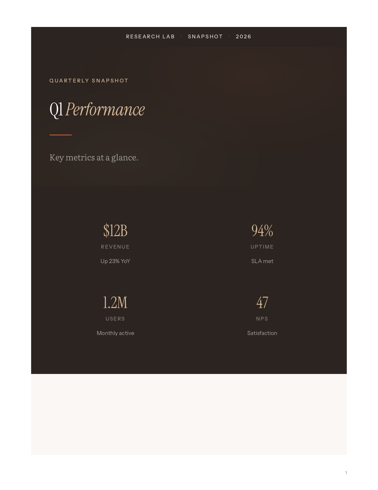 |
| **Midnight Blue** | Corporate, finance, tech | 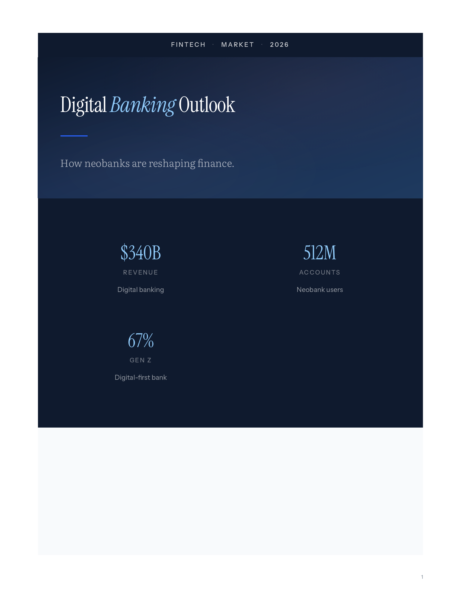 |
| **Forest Green** | ESG, sustainability | 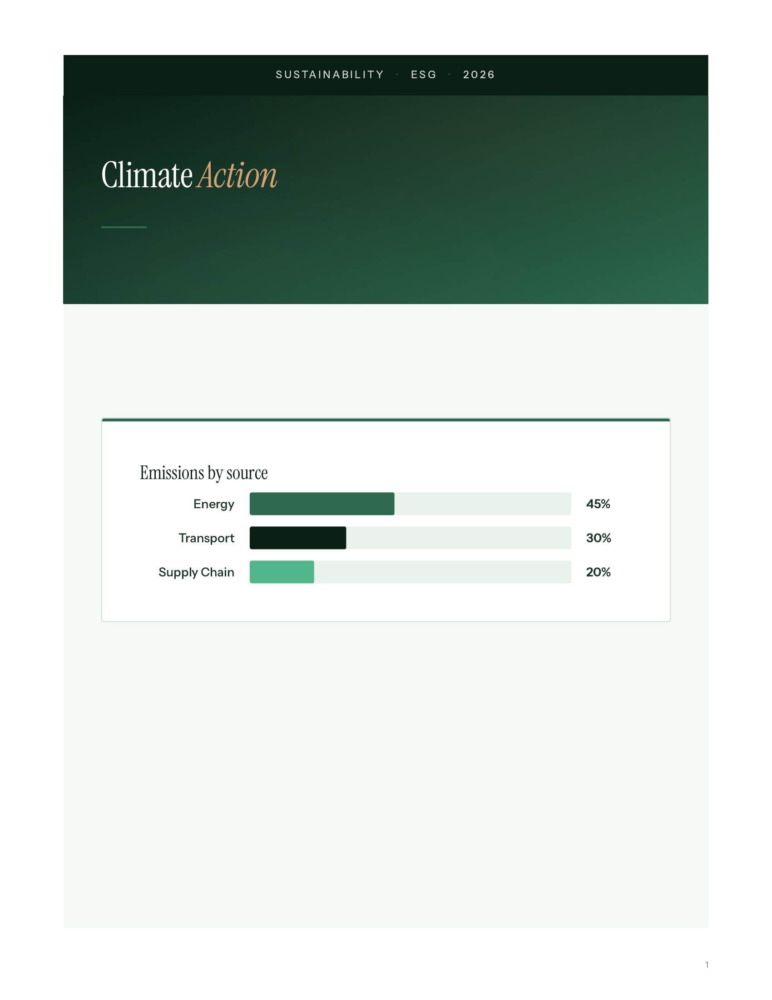 |
| **Crimson** | Security, alerts | 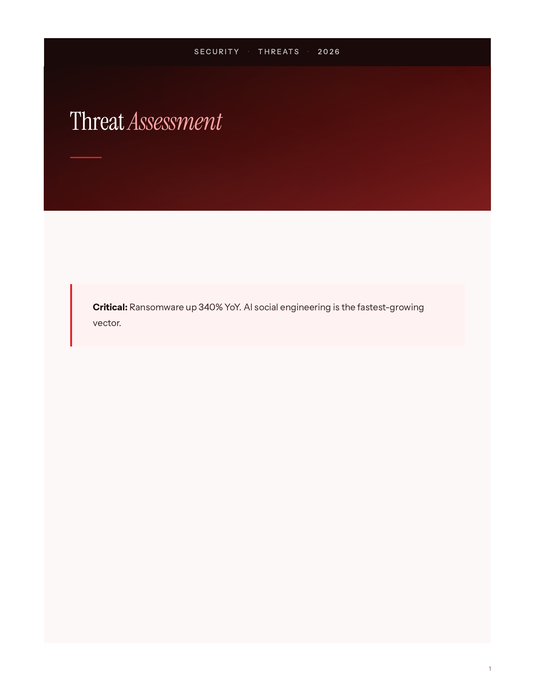 |
| **Slate** | Academic, research | 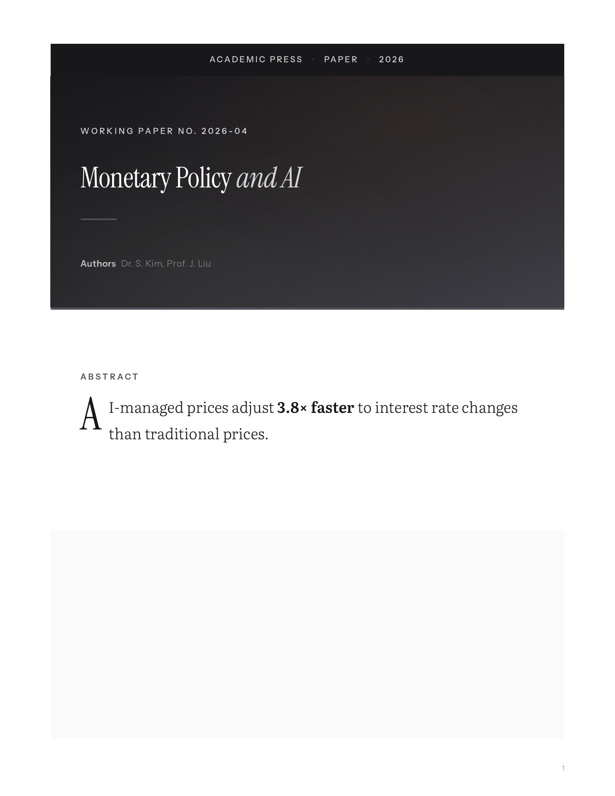 |

## Component Gallery

| Component | Preview |
|-----------|---------|
| Bar Chart | 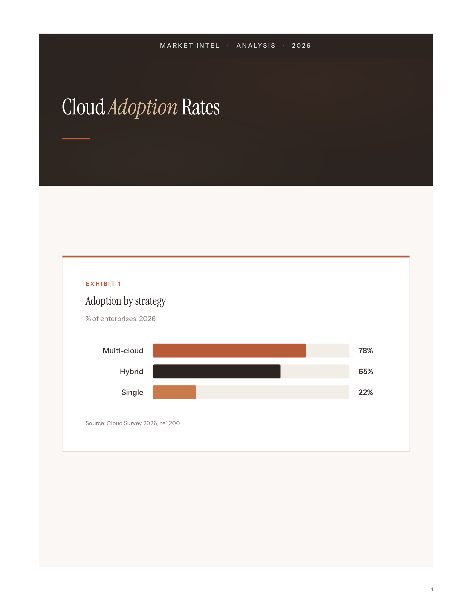 |
| Data Table | 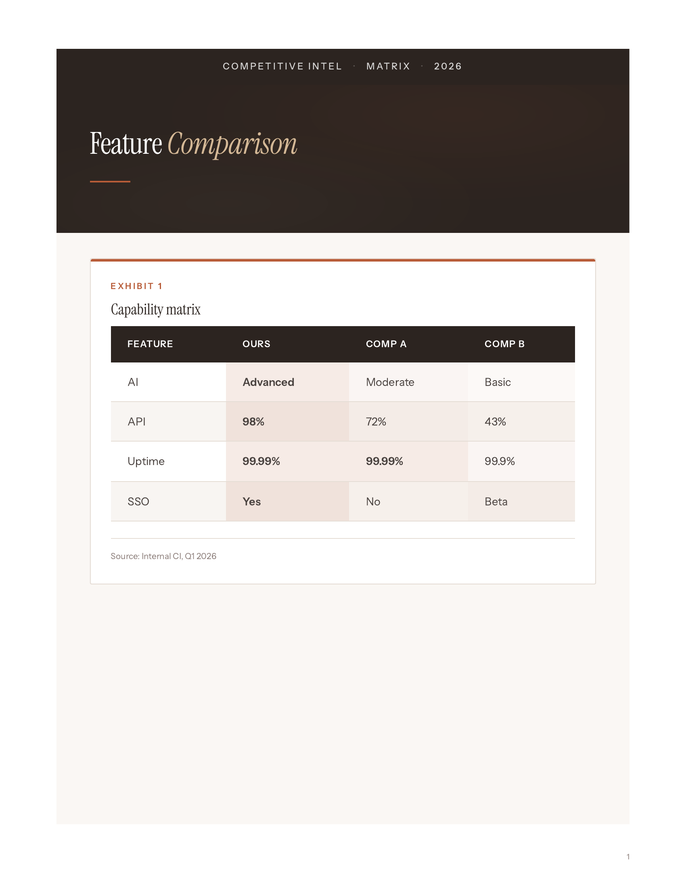 |
| Timeline | 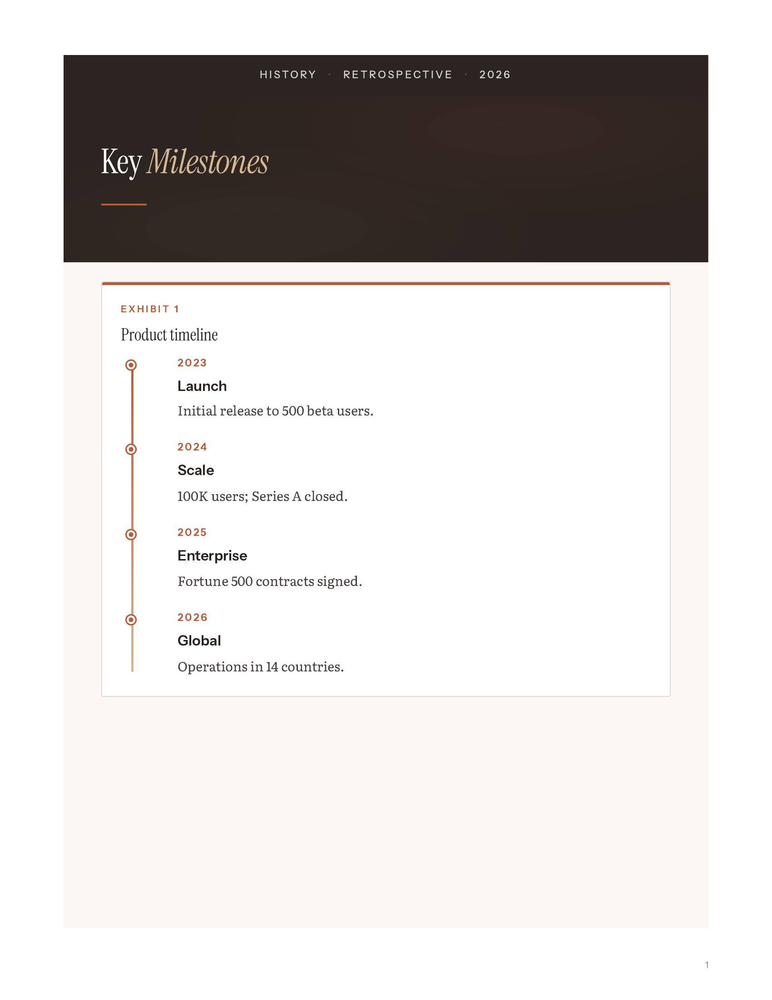 |
| Insight Cards | 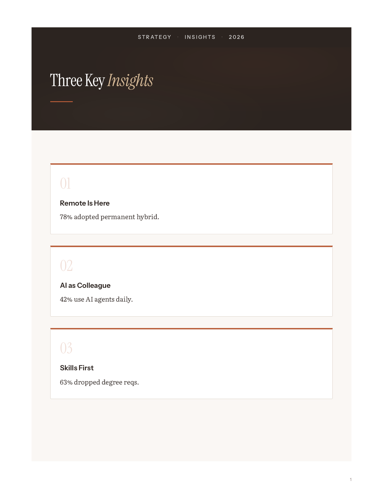 |
| Donut Chart | 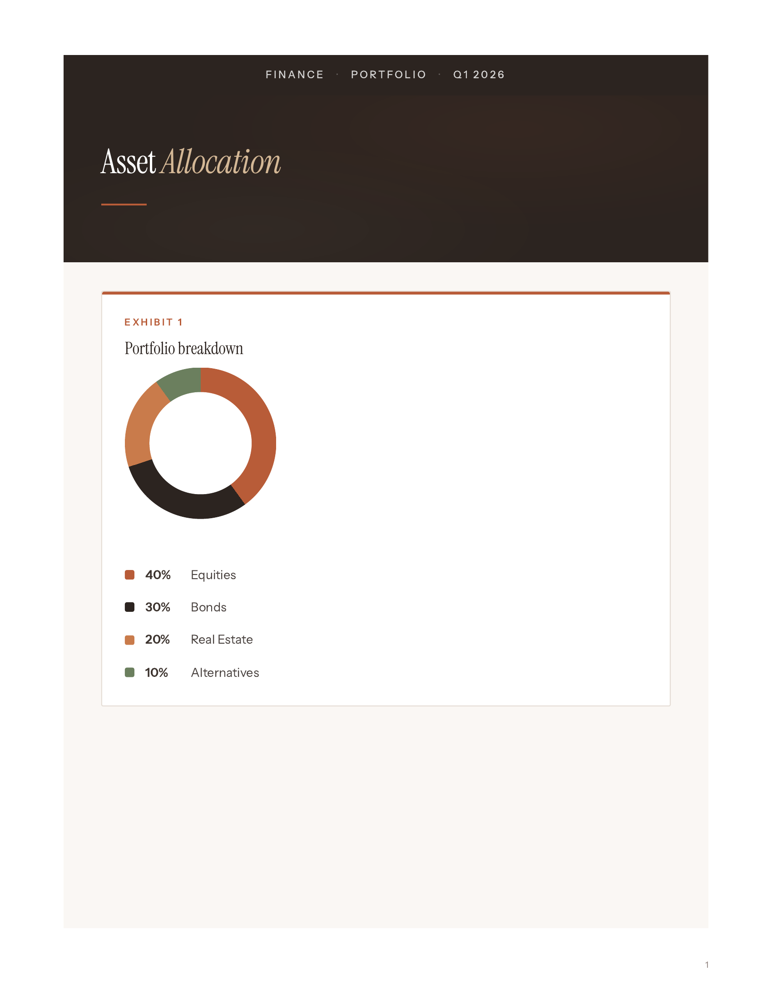 |
| Full One-Pager | 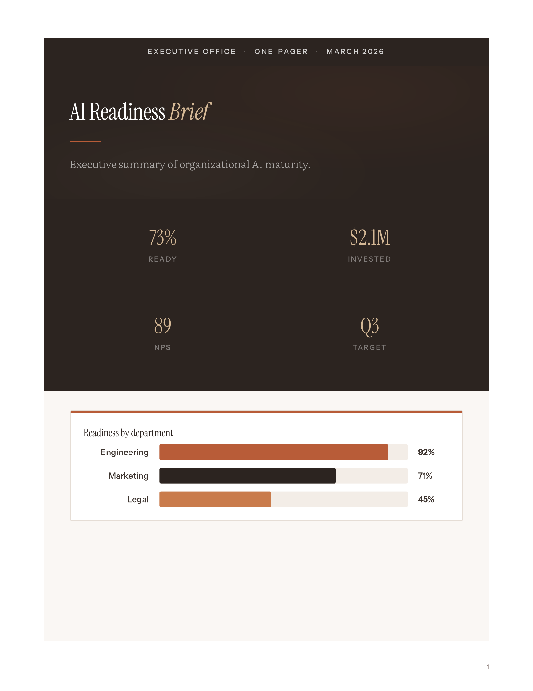 |

## Installation

Copy this directory into your OpenClaw skills folder:

```bash
cp -r pdf-report /data/openclaw/skills/
```

Or clone directly:

```bash
git clone https://github.com/emilyvibecode/pdf-report-skill.git /data/openclaw/skills/pdf-report
```

## Requirements

- **Chromium** (headless) — for PDF rendering
- **Node.js** + Puppeteer (optional, preferred renderer)
- **pdfinfo** (optional) — for page count validation

## License

MIT

## Example Reports

Full PDF reports built with this skill, included in the repo as references:

| Report | Pages | Description |
|--------|-------|-------------|
| [Incident Post-Mortem](references/inspiration/reports/incident-report-sev1-postmortem.pdf) | 19 | SEV-1 API gateway outage report with cover art, charts, timelines, tables, root cause cards |
| [China Analysis](references/inspiration/reports/china-analysis-report.pdf) | 7 | Technology analysis report in consulting style with exec summary and data exhibits |

## External Inspiration

See [SOURCES.md](references/inspiration/SOURCES.md) for links to published reports from McKinsey, Deloitte, Stripe, Airbnb, and others that inspired the design system. We can't include their PDFs, but you can download them to study the design language.
